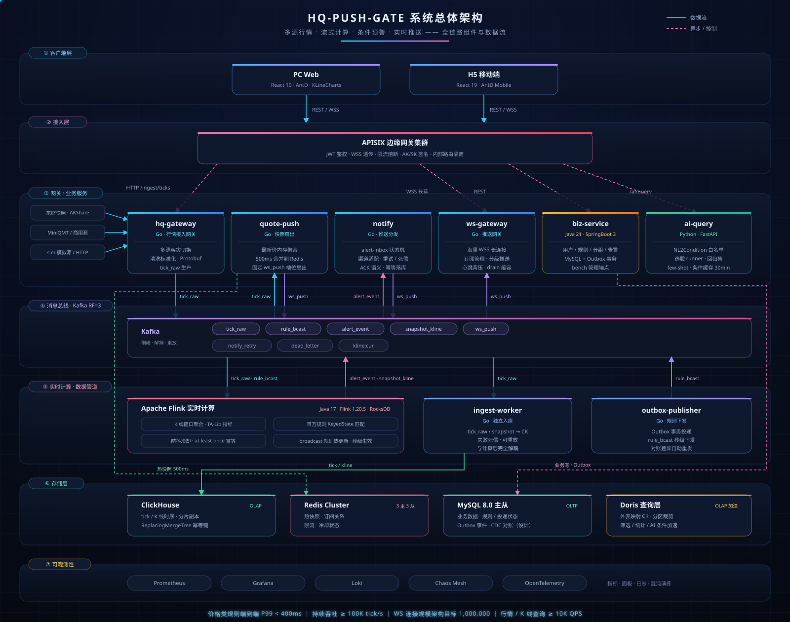
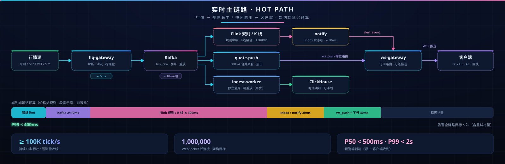

<div align="center">

<picture>
  <source type="image/png" srcset="docs/assets/banner.png">
  
</picture>

# 智析平台 · hq-push-gate

**多源行情接入 · 流式计算 · 条件预警 · 秒级实时推送**

[](https://go.dev)
[](https://flink.apache.org)
[](https://kafka.apache.org)
[](https://clickhouse.com)
[](https://redis.io)
[](https://react.dev)
[](https://kubernetes.io)
[](LICENSE)

[](docs/12-商业产品路线图.md)
[](docs/07-设计基线与验收口径.md)
[](docs/03-架构决策记录-ADR.md)
[](docs/12-商业产品路线图.md)

`≥ 100K tick/s 持续吞吐` · `预警端到端 P99 < 2s` · `WS 连接规模 100 万` · `查询 ≥ 1 万 QPS`

**设计文档**：[docs/](docs/00-总览.md) ｜ **冻结基线**：[docs/07-设计基线与验收口径.md](docs/07-设计基线与验收口径.md) ｜ **分支队列**：[docs/12-商业产品路线图.md](docs/12-商业产品路线图.md)

</div>

---

## 📖 目录导航

[✨ 项目亮点](#-项目亮点) ｜ [🏗️ 总体架构](#️-总体架构) ｜ [⚡ 实时主链路](#-实时主链路) ｜ [🎯 核心设计指标](#-核心设计指标) ｜ [🧩 服务矩阵](#-服务矩阵) ｜ [🗺️ 演进路线](#️-演进路线u-阶段收官状态) ｜ [🎟️ 权益矩阵](#️-行情权益矩阵b22--adr-040) ｜ [📁 仓库结构](#-仓库结构) ｜ [🚀 快速开始](#-快速开始u0-开发环境) ｜ [🔌 端口规划](#-端口规划宿主机统一从-23001-起避开系统常用端口) ｜ [📈 K 线回填](#-历史-k-线与数据回填kline-history) ｜ [🤖 AI 选股](#-ai-智能选股ai-query) ｜ [☁️ K8s 拓扑](#️-k8s-生产拓扑) ｜ [🧪 压测演练](#-压测与演练) ｜ [⚙️ 环境变量](#️-环境变量) ｜ [📚 文档地图](#-文档地图) ｜ [⚠️ 免责声明](#️-业务边界与免责声明) ｜ [📄 许可证](#-许可证)

## ✨ 项目亮点

- 🛰️ **多源行情接入** —— 东财快照 / MiniQMT / 内置模拟源 / HTTP 被动接入，多源容灾自动切换、协议清洗与 Protobuf 标准化；Kafka 瞬断指数退避自愈（1s→30s 封顶），行情源故障网关不退出；
- ⚡ **Flink 流式计算** —— K 线窗口聚合、TA-Lib 指标、**百万规则 KeyedState 匹配**，broadcast 流秒级热更新规则，防抖冷却 + at-least-once 幂等，2JM HA 高可用；
- 🚀 **快照扇出引擎** —— quote-push 内存聚合最新价，合并窗口默认 200ms（`QUOTE_PUSH_MERGE_WINDOW` 可调）刷 Redis 热快照，固定槽位路由扇出 `ws_push`；K 线闭合独立消费组扇出（`snapshot_kline`），订阅即回补当前 bar；
- 📡 **海量长连接** —— ws-gateway 单实例 20 万连接、按连接数 HPA 扩容 + drain 优雅缩容，订阅/心跳/背压/分级推送全链路内建；
- 🎟️ **行情权益门控** —— free/vip 差频推送（quote 10s vs 3s）+ K 线周期白名单（free 仅 `kline@1m`，vip 全周期），Redis 套餐缓存 + 5min 在线复核器，降级/封号下一周期内自动降档；
- 💌 **可靠投递语义** —— notify 内嵌 alert-inbox 状态机（PENDING/SENT/ACKED/EXPIRED），客户端 ACK 确认 + 断线 cursor 补拉；**四渠道适配器**（邮件 / IM / 短信 / Webhook）带熔断保护，失败重试 → 死信可观测；
- 🛡️ **开放平台** —— AK/SK 接入 + 防重放签名协议 + 应用 CRUD + ticket 换取，边缘 JWT 门控，`/open/v1` 独立告警订阅面；
- 💳 **商业化闭环** —— 套餐 / 配额 / 计量 / `user_vip` 写路径（grant、到期降级、planOf 回填）全链路实现，管理端可视化运营；
- 🤖 **AI 智能选股** —— LLM 网关 + 渠道配置化，NL2Condition 白名单条件模型（防幻觉、数值有界）→ 参数化 SQL 查询 CK；选股 runner + 回归集 + few-shot 收尾，条件缓存 30 分钟；
- 🧪 **工程质量底座** —— CI 四门禁、契约（buf/Protobuf）冻结 + ADR 治理、MySQL/CK 版本化迁移 + `schema_migrations` 状态表、备份/恢复演练脚本、Prometheus/Grafana/Loki 全链路观测 + Chaos Mesh 混沌演练。

## 🏗️ 总体架构

<div align="center">

<picture>
  <source type="image/png" srcset="docs/assets/architecture.png">
  
</picture>

</div>

七层拓扑自上而下：**客户端 → APISIX 边缘 → Go/Java 服务群 → Kafka 流总线 → Flink 实时计算 → 分层存储 → 可观测底座**。所有实时数据流经 Kafka 总线削峰解耦，计算、扇出、落库三条消费支路互不阻塞、各自水平扩展。

## ⚡ 实时主链路

<div align="center">

<picture>
  <source type="image/png" srcset="docs/assets/pipeline.png">
  
</picture>

</div>

```text
行情源 → hq-gateway → Kafka(tick_raw) → Flink → alert_event → notify(内嵌 alert-inbox) → ws-gateway → 客户端(ACK)
行情源 → Kafka(tick_raw) → quote-push → Redis 快照 + 固定 ws_push 槽位 → ws-gateway → 客户端
行情源 → Kafka(tick_raw) → quote-push(snapshot_kline) → K线扇出 + kline:cur 回补 → ws-gateway → 客户端
行情源 → Kafka(tick_raw) → ingest-worker → ClickHouse（异步，可滞后）
```

全流程联调已实测闭环：**29 quotes + 2 alerts + 2 acks 全链打通**（源 → 计算 → 告警 → 投递 → ACK）。

## 🎯 核心设计指标

| 维度 | 指标 | 验收值 |
|---|---|---|
| 吞吐 | tick 处理能力 | **≥ 10 万条/秒** 持续（benchmark-small 全量口径 docs/07 §9） |
| 延迟 | 预警端到端（源 → 客户端收到） | P50 < 500ms，**P99 < 2s**；价格类规则 P99 < 400ms |
| 并发 | WebSocket 长连接 | **100 万**规模（docs/07 §3 连接层目标）；单机 smoke 实测 300 连接收 13.4 万推送 |
| 查询 | 行情 / K 线查询 | ≥ 1 万 QPS（缓存命中率 > 90%） |
| 数据 | 时序存储规模 | 百亿~千亿行（CK 分片 + S3 归档） |
| 可用性 | 整体 SLO | 99.9%，核心链路 MTTR < 5min |
| 扩展 | 水平扩展线性度 | Flink / WS 网关 / 查询服务 扩容加速比 ≥ 0.7 |

## 🧩 服务矩阵

| 组件 | 技术栈 | 职责 | 扩展方式 |
|---|---|---|---|
| hq-gateway | Go | 多源容灾、协议解析、清洗标准化、输出 tick_raw | 按市场/数据源加实例 |
| quote-push | Go | 最新价内存聚合、200ms 合并刷 Redis、quote/K线双路扇出 | 加实例（symbol 分片） |
| notify | Go | alert-inbox 投递状态机、四渠道适配（mail/im/sms/webhook）、熔断重试死信 | 加实例 |
| ws-gateway | Go | 海量 WSS 长连接、订阅管理、权益门控差频、心跳/背压 | 加实例 + 客户端重连再平衡 |
| ingest-worker | Go | 独立消费 tick_raw/snapshot 写 CK、死信重放、与 Flink 解耦 | 加实例 |
| outbox-publisher | Go | Outbox 事务投递 → rule_bcast，规则秒级热更新下发 | 加实例 |
| biz-service | Java 21 · SpringBoot 3 | 用户/规则/分组/告警、套餐 VIP、开放平台 AK/SK、查询编排、bench 管理端点 | 加 pod |
| Flink Job | Java 17 · Flink 1.20.5 | K 线窗口、TA-Lib 指标、百万规则 KeyedState 匹配、防抖冷却 | 加 TaskManager（2JM HA） |
| ai-query | Python · FastAPI | NL2Condition、选股 runner/回归集/few-shot、CK 参数化筛选 | 单实例 |
| APISIX | ×2 | 唯一公网入口：JWT、限流、WSS 透传、AK/SK 防重放 | 加节点 |
| pc-web / h5 | React 19 | To-C 双端行情/告警/K线图（AntD / AntD Mobile + KLineCharts） | 静态托管 + CDN |
| admin | React 19 · Vite | 管理端：渠道配置、用户/套餐运营、LLM 网关配置 | 静态托管 |

## 🗺️ 演进路线（U 阶段收官状态）

| 阶段 | 主题 | 状态 |
|---|---|---|
| **U0** 启动（0~1k） | 全链路打通 · 开发环境 · 基础压测 | ✅ 已完成（E2E 闭环实测） |
| **U1** 内测（1k~5k） | 真实用户全链路 + 渠道可运营（B16 渠道/LLM 网关、B17 契约加固） | ✅ 已完成 |
| **U2** 小规模生产（5k~10k） | 能收费、能开放、能扛故障（B18 开放平台、B19 商业闭环、B20 选股收尾、B21 订阅扇出、B22 权益门控、B23 热路径性能与治理、B24 文档审计收口） | ✅ 功能全量落地 |
| **U3** 增长 | 规模化与变现验证 · benchmark 全量口径集群验收 | ✅ 验收口径达成（docs/07 §9） |

分支队列 B16~B24 已全部合入主干收官，逐分支交付明细见 [docs/12 §2](docs/12-商业产品路线图.md)。

## 🎟️ 行情权益矩阵（B22 · ADR-040）

WS 行情通道按 `user_vip.plan_type` 门控与差频（per-conn 合并帧，丢旧保新）：

| 用户类型 | quote 合并帧间隔 | kline 周期档位 |
|---|---|---|
| free | **10s**（降频） | 仅 `kline@1m` |
| vip1~vip3 | **3s**（quote@3s 默认契约） | `kline@1m/3m/5m/15m/30m/60m/1d` 全周期 |

- 数据源：Redis `user_vip:{id}`（TTL 5min），biz-service 写路径同步（grant / 到期降级 / planOf 回填），ws-gateway 只读免打库；
- sub 门控：free 订阅 `kline@3m+` 的 channel 被权益白名单忽略；每 5min 按在线用户复核，降档自动生效；
- 3s/10s 仅实时流，不落 CK（ADR-041 亚分钟口径）。

## 📁 仓库结构

| 目录 | 内容 |
|---|---|
| `proto/` | 公共消息契约（buf 生成，`make proto-gen`） |
| `packages/` | Go 共享包（contract、kafkax、obs、configx、httpx）+ 前端共享（@hq/api-client、@hq/shared） |
| `services/` | hq-gateway、quote-push、notify、ws-gateway、ingest-worker、outbox-publisher、biz-service(Java) |
| `flink/` | Flink 规则/K线作业（Java 17 · Flink 1.20.5，`make flink-build`；biz-service 为 Java 21） |
| `apps/` | pc-web（React 19 + AntD + klinecharts）、h5（React 19 + AntD Mobile）、admin（管理端） |
| `bench/` | tick 模拟源、WS 压测客户端（symbols + channels 订阅验证） |
| `deploy/` | docker-compose（U0）、k8s、APISIX、初始化脚本 |
| `migrations/` | MySQL / ClickHouse 版本化迁移 |
| `observability/` | Prometheus / Grafana 配置 |
| `scripts/` | K 线回填、对账、迁移 apply、备份/恢复、契约同步 |
| `ai-query/` | AI 智能选股（NL2Condition + runner + 回归集，FastAPI） |
| `docs/assets/` | 本页 banner / 架构图 / 主链路图（SVG 矢量源文件 + 2x PNG 渲染版，改 SVG 后可用 chromium headless 重新导出 PNG） |

## 🚀 快速开始（U0 开发环境）

```bash
# 1. 基础设施（MySQL、Redis、Kafka、ClickHouse + Topic 初始化）
docker compose -f deploy/docker-compose.yml up -d

# 2. 生成契约代码（首次）
make proto-gen
scripts/sync-proto.sh   # 同步契约到 Flink 模块（Java 构建前执行）

# 3. 启动服务（4 个终端）
make run-hq-gateway
make run-quote-push
make run-notify
make run-ws-gateway

# 4. 注入模拟行情
make run-tick-source

# 5. 前端（可选）：安装依赖并启动开发服务器
make web-install
make web-dev-pc   # http://localhost:23031（/api 代理 biz-service，/ws 代理 ws-gateway）
make web-dev-h5   # http://localhost:23032
```

### WS 联调协议

连接与消息示例（正式环境 token 为 JWT）：

```text
ws://localhost:23024/ws?token=...                                  # uid/typ/key claim，ws-gateway 校验 typ=access
C->S {"type":"sub","symbols":["A_SHARE:600000"]}                   # 亦可 channels:["kline@1m"]
C->S {"type":"ping"}                                               # 30s 心跳
S->C {"type":"quote","data":[{symbol,last,pct,vol,ts}]}
S->C {"type":"kline","data":{symbol,period,begin_ts,open,high,low,close,volume,amount}}
S->C {"type":"alert","data":{deliveryId,eventId,ruleId,symbol,title,detail,ts}}
C->S {"type":"ack","deliveryId":"..."}                             # 断线后 GET /api/v1/alerts?cursor= 补拉
```

free/vip 差频与 kline 周期白名单见上方 [行情权益矩阵](#️-行情权益矩阵b22--adr-040)。

## 🔌 端口规划（宿主机统一从 23001 起，避开系统常用端口）

| 段 | 分配 |
|---|---|
| 23001–23020 | 基础设施：MySQL 23001 · Redis 23002 · Kafka 23003 · CK 23004/23005 · Flink UI 23006 · Prometheus 23007 · Grafana 23008 · Alertmanager 23009 · APISIX 23010(HTTP)/23011(HTTPS/WSS)/23012(metrics) |
| 23021–23026 | 业务服务：hq-gateway 23021 · quote-push 23022 · notify 23023 · ws-gateway 23024 · outbox-publisher 23025 · biz-service 23026 |
| 23031–23032 | 前端 dev：pc-web 23031 · h5 23032 |
| 23041 | ai-query（NL2Condition，FastAPI） |
| 23040+ | 其余预留（Doris/Debezium/K8s） |

### 可选：APISIX 边缘网关（U1）

```bash
docker compose -f deploy/docker-compose.yml --profile edge up -d apisix
# 入口：http://localhost:23010  https://localhost:23011(WSS，自签证书需 -k / 信任证书)
# 边缘行为：/api/* 无 token 401 + IP 限流；/ws Upgrade 代理 + 并发限流；/internal/* 403
```

开发证书不入库：运行 `scripts/gen-dev-cert.sh` 生成 `deploy/apisix/certs/dev.crt / dev.key`
（CN/SAN=localhost，仅本地开发用），再把 PEM 内容粘贴进 `deploy/apisix/apisix.yaml` 的
`ssls.cert/key`（standalone 模式只接受 PEM 内容字符串，不支持文件路径）。

## 📈 历史 K 线与数据回填（kline-history）

```bash
# 数据回填（CK 写入走静态 SQL + JSONEachRow body；东财接口带镜像轮换与频控）
py -3 scripts/backfill/eastmoney_1m.py --symbols 600519,000001 --days 5  # 近 5 交易日 1m（不复权）
py -3 scripts/backfill/baostock_5m.py --codes sh.600519 --start 2011-01-01  # 5m 深历史（断点续传）
py -3 scripts/backfill/sync_symbol_meta.py            # 全市场列表 → symbol_meta V2（幂等 upsert）
# 每日 15:30 对账（按复权基准分组比较，raw 组硬比较；缺口生成补拉清单）
py -3 scripts/reconcile/kline_reconcile.py --symbols 600519 --days 10
```

- REST：`GET /api/v1/quote/kline?market=&symbol=&period=&start=&end=&limit=`（缓存→CK，
  SQL 全参数绑定；period 15/30/60/1440 由 1m 查询时滚动聚合）
- 前端 ChartPage：REST 历史首屏 + WS 行情客户端聚合实时 bar
- CK 引擎口径：U0 单节点为非复制 `ReplacingMergeTree(ingest_version)`（幂等键 event_id，
  查询不依赖 FINAL）；生产集群 Replicated + Distributed

## 🤖 AI 智能选股（ai-query）

```bash
pip install -r ai-query/requirements.txt
py -3 -m uvicorn app.main:app --host 127.0.0.1 --port 23041   # 工作目录 ai-query/
```

- 依赖根目录 `.env` 的 `LLM_*` 配置（OpenAI 兼容：火山方舟/siliconflow/qwen/deepseek 均可）；
  Coding Plan 端点（`/api/coding/v3`）按编码工具校验 UA，`LLM_USER_AGENT` 可覆盖；
- `POST /api/v1/ai/query {"q":"股价大于8元的股票"}`：LLM 解析 → **白名单条件模型**
  （PRICE_ABOVE/BELOW/RANGE、PCT_CHANGE、VOLUME_ABOVE，数值有界，越界/未知类型拒绝）
  → CK 参数化筛选最新快照；结果缓存 `aicond:{hash}` 30min；
- 选股 runner + 回归集 + few-shot 已收尾（B20），组合条件模型支持多条件与分组落规则；
- 边缘路由：`POST /ai/query`（APISIX 重写至服务内部路径，边缘 JWT + 30/min 限流）。

## ☁️ K8s 生产拓扑

`deploy/k8s/`：命名空间/配额/优先级、无状态服务（Deployment+HPA+PDB+反亲和，ws-gateway
按连接数扩容 + drain 缩容）、有状态组件 Operator CR（Strimzi/Altinity/Flink/Redis）、
对账 CronJob、APISIX Ingress。安装顺序与前置 Operator 见 `deploy/k8s/README.md`。

## 🧪 压测与演练

```bash
# biz-service 开启 bench 总关（HQ_BENCH_ENABLED=true）后：
curl -X POST -H "X-Internal-Token: dev-internal-token" -H "Content-Type: application/json" \
  -d '{"rate":3000}' http://127.0.0.1:23026/api/v1/admin/bench/tick-source   # 内置模拟源调压
curl -X POST -H "X-Internal-Token: dev-internal-token" -H "Content-Type: application/json" \
  -d '{"count":50}' http://127.0.0.1:23026/api/v1/admin/bench/users          # 批量造用户
curl -X POST -H "X-Internal-Token: dev-internal-token" -H "Content-Type: application/json" \
  -d '{"userId":1,"count":500}' http://127.0.0.1:23026/api/v1/admin/bench/rules  # 批量造规则
curl -H "X-Internal-Token: dev-internal-token" http://127.0.0.1:23026/api/v1/admin/metrics/overview

# WS 压测（生产 JWT 密钥时传 -secret；U0 联测 token 用 -token 前缀）
go run ./bench/ws-bench/cmd/ws-bench -users 300 -symbols 5 -duration 40s -secret dev-jwt-secret
```

- benchmark-small 全量口径（10 万 tick/s / 10 万连接 / 100 万规则）按 docs/07 §9 验收口径在 U3 集群执行；
- Chaos Mesh 混沌演练覆盖 Kafka 瞬断、broker 宕机、WS 节点驱逐等场景（观测指标见 `observability/`）。

## ⚙️ 环境变量

各服务使用统一前缀配置（`HQ_GATEWAY_*`、`QUOTE_PUSH_*`、`NOTIFY_*`、`WS_GATEWAY_*`、`INGEST_*`），
默认值面向本机 Compose；见各服务 `internal/config/config.go`。

### 内置行情源（hq-gateway）

`HQ_GATEWAY_SOURCE` 选择进程内主动拉取源（HTTP 被动接入 `/ingest/ticks` 始终可用）：

| 值 | 说明 |
|---|---|
| `off`（默认） | 不启用内置源，仅被动接入（bench/tick-source 推送） |
| `sim` | 内置模拟源（随机游走），收盘后/无外网联调；`SIM_RATE`/`SIM_BATCH`/`SIM_SYMBOLS` |
| `eastmoney` | 东财免费快照轮询（免账号，AKShare 同源）；`EAST_INTERVAL`/`EAST_SYMBOLS`/`EAST_MIN_GAP` 等 |

```bash
HQ_GATEWAY_KAFKA_BROKERS=localhost:23003 \
HQ_GATEWAY_SOURCE=eastmoney go run ./services/hq-gateway/cmd/hq-gateway
```

东财源自带防封口径：请求最小间隔 + 失败指数退避（封顶 5m）；主域被限流时自动切换
push2delay 镜像；Kafka 瞬断致 source 退出时指数退避重启（1s→30s 封顶），网关不退出。
生产主力源为 MiniQMT/商用源（docs/09 §5.1）。

## 📚 文档地图

| 文档 | 内容 |
|---|---|
| [00-总览](docs/00-总览.md) | 项目定位、技术指标、业务边界、文档导航 |
| [01-需求规格说明书](docs/01-需求规格说明书.md) | 功能/非功能需求、PC/H5 双端功能矩阵、量化指标 |
| [02-总体架构设计](docs/02-总体架构设计.md) | 分层架构、数据流、高可用/高性能/高并发专项设计 |
| [03-架构决策记录-ADR](docs/03-架构决策记录-ADR.md) | **41 项**关键决策及取舍理由 |
| [04-数据模型与接口契约](docs/04-数据模型与接口契约.md) | Protobuf、Kafka Topic、MySQL/CK DDL、REST API、WS 协议 |
| [05-容量规划与性能压测方案](docs/05-容量规划与性能压测方案.md) | 容量推算、集群规格、6 类压测场景与实验设计 |
| [06-部署方案与演进路线](docs/06-部署方案与演进路线.md) | compose 开发环境 → K8s 生产拓扑、里程碑 |
| [07-设计基线与验收口径](docs/07-设计基线与验收口径.md) | 冻结架构、资源档位、协议语义与最终验收边界 |
| [08-工程实施与仓库规范](docs/08-工程实施与仓库规范.md) | 启动流程、分阶段实施、Git 目录和命名规范 |
| [09-最终规划与技术选型](docs/09-最终规划与技术选型.md) | 分阶段最终拓扑、同品种选型理由、实施顺序 |
| [10-商业化与通知渠道设计](docs/10-商业化与通知渠道设计.md) | 渠道层/商业层/开放层设计、套餐配额、行情权益矩阵 |
| [11-接口与安全规范](docs/11-接口与安全规范.md) | 报文信封、错误码注册表、鉴权矩阵、AK/SK 防重放协议 |
| [12-商业产品路线图](docs/12-商业产品路线图.md) | 计划 vs 实际审计、U 阶段落位、B16~B24 分支队列收官 |

## ⚠️ 业务边界与免责声明

- **只做**：行情查看、指标计算、条件预警、智能分组、消息推送、AI 筛选；
- **不做**：实盘交易、买卖点推荐、资金托管；商业化（套餐/配额/开放平台/计费计量）为设计与技术实现交付物，不实际运营收费；
- 数据源采用开源数据 + 可控模拟负载生成器，无行情版权依赖；所有输出仅为数据展示与条件触达，**不构成投资建议**。

## 🛠️ 开发约定

- 公共协议、Topic、告警 ID 语义为冻结项，变更必须新增 ADR（docs/07 §10）；
- 提交格式 `<type>(scope): <中文动词开头摘要>`；
- 合并前：`make vet && make test`；CI 四门禁（Go / Java / Python / Web 四语言流水线）全绿。

## 📄 许可证

本项目基于 [Apache-2.0](LICENSE) 协议开源；所引用第三方组件与数据源权益归各自权利人所有。
行情数据来自公开免费接口与内置模拟源，平台输出不构成任何投资建议（详见[业务边界与免责声明](#️-业务边界与免责声明)）。
