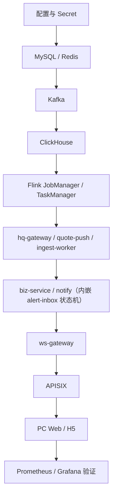
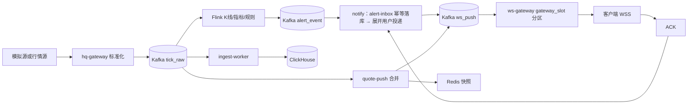
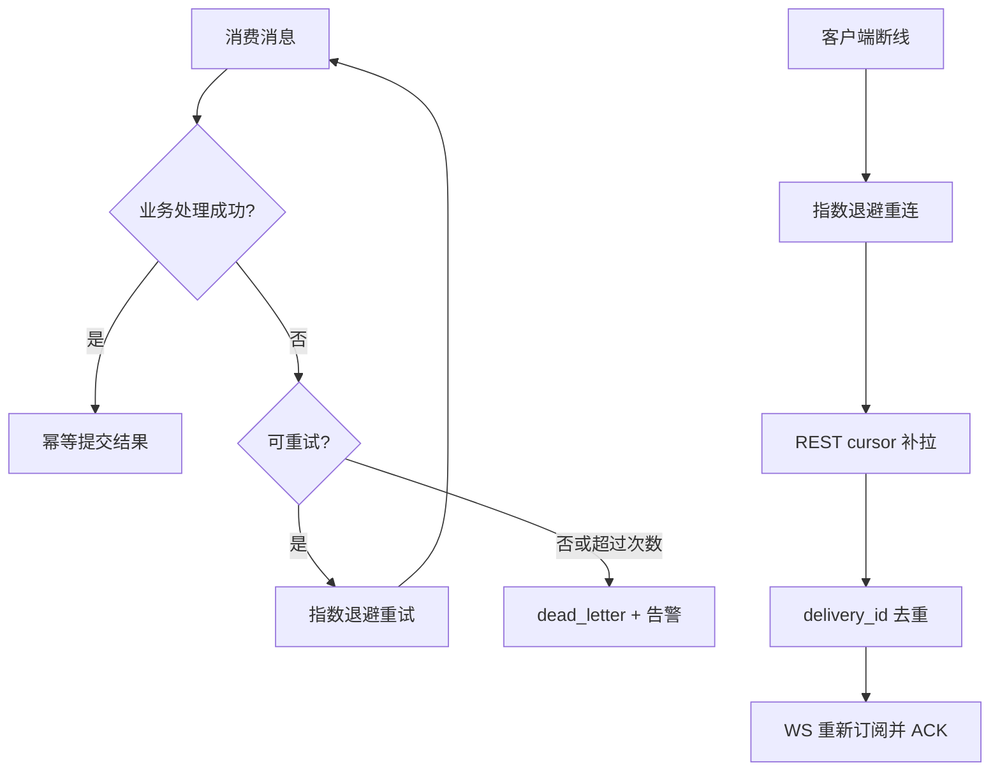

# 工程实施与仓库规范

> 项目：hq-push-gate 智析平台 | 版本：V2.1
>
> 本文档将架构基线转换为工程启动、分阶段部署和协作开发规则。设计冻结项以 [07-设计基线与验收口径](./07-设计基线与验收口径.md) 为准。
>
> 用户阶段、同品种选型和生产补强项的最终汇总见 [09-最终规划与技术选型](./09-最终规划与技术选型.md)。

## 1. 工程实施原则

1. 逻辑架构一次确定，物理部署按用户规模缩容或扩容。
2. 公共协议先行：先生成 Protobuf、REST OpenAPI 和 WS 类型，再实现生产者与消费者。
3. 先闭环后扩展：先完成行情、规则、告警、推送和补拉，再加入指标、AI、补数和多市场。
4. 每个服务只拥有自己的职责和数据写入边界，不跨服务直接读写别人的数据库表。
5. 所有异步消费必须具备幂等键、重试策略、死信指标和可重放入口。
6. 所有阶段使用同一服务名、Topic 名、字段名和错误模型，阶段差异只通过配置控制副本、分区和资源。

## 2. 启动顺序与主流程

### 2.1 基础设施启动顺序



生产环境使用 Operator 或 Helm 管理有状态组件；开发环境允许 Compose 简化为单副本。任何服务启动后必须先通过 `/healthz`，依赖连接检查通过后才进入 readiness。

### 2.2 行情、规则和告警主流程



### 2.3 失败和恢复流程



## 3. 分阶段实施方案

### 3.0 ClickHouse、Doris 与 Debezium 的启用策略

三者不是同一类组件，不能按“用户数到了就一起启动”处理：

| 组件 | 主要职责 | U0 | U1 | U2 | U3+ |
|---|---|---|---|---|---|
| ClickHouse | tick/K 线明细、历史行情查询 | 单节点，保留核心写入链路；也可在纯实时演示时暂缓 | 单节点独立数据盘，启用批量写和备份 | 读写与实时链路隔离，开始执行副本/分片规划 | 按数据量、写入速率和查询负载扩展，启用分片、副本和归档 |
| Doris | 告警分析、统计、AI 筛选和复杂 OLAP | 关闭；历史查询走 ClickHouse 或只提供简化查询 | 仍可关闭；只做产品确实需要的分析查询 | 单节点或缩容集群，验证告警查询和统计 | 多 FE/BE，承载分析和 AI；不进入实时推送热路径 |
| Debezium | MySQL binlog CDC、规则版本对账和审计同步 | 不启用；由 outbox-publisher 发布 `rule_bcast` | 可选，用于验证规则变更对账 | 启用单实例 CDC，补偿规则广播差异 | 集群化部署，监控 offset、延迟和重复事件 |

U0 的最小闭环不是“没有存储”，而是：MySQL 保存业务数据，ClickHouse 保存需要回看的行情明细，Redis 保存热状态；Doris 和 Debezium 属于按需求开启的增强组件。U0~U1 禁止为了追求“完整生产拓扑”提前引入 Doris 和 Debezium，避免把排障范围扩大到没有业务价值的组件。

规则同步的阶段差异如下：

```text
U0/U1: biz-service -> MySQL + outbox_event -> outbox-publisher -> Kafka rule_bcast -> Flink
U2+:   MySQL -> Debezium -> 对账任务 -> 差异重发 rule_bcast
```

Debezium 是补偿和对账通道，不替代 `rule_bcast` 主通道，也不直接把 CDC 事件当成 Flink 的第二条实时规则流。

### 3.1 U0：0~1,000 用户，0~100 在线

启用核心闭环：`hq-gateway、Kafka、Flink、quote-push、ingest-worker、biz-service、notify、ws-gateway、MySQL、Redis、ClickHouse`。采用 Compose 或 1~2 台虚机，核心组件单副本；Doris、Debezium、AI、Chaos Mesh 和多市场先关闭。若只是纯实时演示，可暂缓 ClickHouse，但进入 U1 前必须补上历史行情落库和备份。

实现顺序：

1. 建立 `proto/`、Topic 初始化和 MySQL DDL。
2. 完成模拟 tick → Kafka → Flink 价格规则 → alert-inbox → notify → WS 的闭环。
3. 完成 WS 订阅、行情合并、告警 ACK、`/alerts?cursor=` 补拉。
4. 增加健康检查、结构化日志、基础指标、备份和一键恢复脚本。

验收重点是功能和数据恢复，不宣称 HA 或生产级吞吐。

### 3.2 U1：1,000~5,000 用户，100~300 在线

保持服务边界不变，将 APISIX、biz-service、ws-gateway 扩为至少双副本；Kafka、Redis、ClickHouse 仍可缩容混部。重点实现滚动重启、客户端重连、告警补拉和基础限流。

必须增加：

- 连接数、订阅数、发送队列长度和重连次数指标；
- Kafka consumer lag 和 dead letter 监控；
- Redis TTL 心跳和 `gateway_slot` 租约续期；
- 每周恢复演练，验证 MySQL、Redis 和 ClickHouse 备份可用。

### 3.3 U2：5,000~10,000 用户，300~1,000 在线

进入小规模生产部署：Kafka 3 broker、Flink 2 JM HA + 2~4 TM（FC-1 决策，与 docs/09/07 修订一致）、WS 2~3 实例、Redis 主从、MySQL 主从。启用基础故障演练、PDB、滚动发布、限流和服务降级。

此阶段开始要求：核心服务无状态、配置外置、数据库迁移可回滚、告警服务端不丢、单实例故障后客户端可以重连并补拉。

### 3.4 U3：1万~10万用户，1,000~10,000 在线

进入 `benchmark-small` 基线：实时、推送、查询和离线资源池隔离；WS 按连接数扩容；执行 10 万 tick/s、10 万连接和 100 万规则验证。此阶段不把 Doris/ClickHouse 的大规模冷查询与百万连接放在同一验收项中。

### 3.5 U4/U5：10万+用户

进入独立 K8s 资源池：WS、Redis、Kafka 分区、出口带宽和压力源单独扩展；使用固定 64 分区 `ws_push` 和 `gateway_slot` 租约。U5 使用 benchmark-large 验证百万连接、分级推送、重连风暴和 2 小时长稳。

扩容顺序固定为：

```text
业务副本 -> ws-gateway -> Redis 分片 -> Kafka 分区 -> quote-push/notify -> 出口带宽 -> OLAP 分片
```

不能通过增加 MySQL 或 Doris 副本解决 WS 连接和推送出口瓶颈。

## 4. 服务内部框架

### 4.0 中间件拓扑与选型

#### 4.0.1 按阶段的推荐拓扑

| 组件 | U0：0~1000 用户 | U1：1000~5000 | U2：5000~1万 | U3：1万~10万 | U4/U5：10万+ |
|---|---|---|---|---|---|
| Kafka | 1 broker、单副本、开发分区数 | 1 broker 或 3 broker 预生产拓扑 | 3 broker、KRaft、RF=3、min.insync.replicas=2 | 3~5 broker，按吞吐增加分区 | 独立节点，按吞吐和分区扩展，跨 AZ |
| Flink | 1 JM + 1 TM，非 HA | 1 JM + 2 TM，checkpoint | 2 JM HA + 2~4 TM | 2 JM HA + 4~8 TM，独立资源池 | 独立 K8s 资源池，按并行度和状态大小扩展 |
| Redis | 单实例，持久化和备份 | 主从或 Sentinel | 主从 + Sentinel（分片需要时 U3+ 起 Cluster，与 §3.3 统一） | Cluster 扩分片，连接路由与快照分离 | 独立 Redis 资源池，多分片、多 AZ |
| MySQL | 单主单库 | 单实例 + 每日备份（FC-2 修订） | 主从/自动故障切换 + 读写分离 | 告警表时间分区、归档，仍不默认分片 | 先垂直拆库，实测瓶颈后按 user_id 分片 |
| ClickHouse | 单节点，批量写和备份 | 单节点独立数据盘 | 基础副本或双节点验证 | 2 分片 × 2 副本，TTL 和归档 | 按数据量、写入和查询扩展分片/副本 |
| Doris | 关闭 | 关闭或单节点 | 单节点/缩容集群，按分析需求启用 | 3 FE + 3 BE 或托管集群 | 多 FE/BE，独立查询资源池 |
| Elasticsearch | 不部署 | 不部署 | 不部署 | 只有全文检索需求才评估 | 独立搜索集群，不能替代 CK/Doris |
| OTel/观测 | Prometheus + Grafana + stdout | Alertmanager（已落地）；Loki 规划态（docs/06 注记③，U2 复评） | 加 OTel Collector + Tempo | 加 Pyroscope 和长期存储 | 观测组件独立资源池 |

U0~U1 可以缩容基础设施，但必须保留相同 Topic、消息字段、数据边界和恢复语义。U2 开始才把高可用组件作为小规模生产基线，U3 才进入正式分布式压测。

#### 4.0.2 Kafka 与 RabbitMQ 的选择

本项目选 Kafka，不选 RabbitMQ 作为实时主总线：

| 对比项 | Kafka | RabbitMQ |
|---|---|---|
| 主要定位 | 高吞吐事件流、持久化日志、按 offset 重放 | 业务消息队列、路由、任务投递和确认 |
| 本项目需求 | tick_raw、rule_bcast、alert_event、ws_push 的持续流和重放 | 只有短任务或复杂路由才有价值 |
| 消费模型 | 多个独立消费组读取同一事件流，适合 Flink/入库/扇出 | 多队列复制消息，百万 tick 场景运维和吞吐压力更高 |
| 故障恢复 | offset 重放、分区副本、顺序和保留窗口 | ack、重投、死信，适合任务型消息 |
| 最终决策 | 主链路统一使用 Kafka | 当前不引入；未来独立任务有明确需求时再单独评估 |

不要同时用 Kafka 和 RabbitMQ 传递同一类实时事件。双总线会产生重复可靠性语义、监控入口和故障排查路径。

#### 4.0.3 Elasticsearch 是否需要

当前不需要 Elasticsearch：

- 日志检索由 Loki 负责；
- 行情和 K 线由 ClickHouse 负责；
- 告警分析和 AI 筛选由 Doris 负责；
- 用户、规则和标的精确查询由 MySQL/Redis 负责；
- 标的搜索初期用 MySQL 前缀索引和 Redis 热缓存即可。

只有出现中文分词、复杂全文检索、模糊搜索规模显著增长，或日志团队已有 Elasticsearch 统一平台时，才引入 ES。引入时仅承担搜索索引，不作为事务库、时序库或 Kafka 替代品。

### 4.1 Go 服务通用结构

适用于 `hq-gateway、quote-push、ws-gateway、notify、ingest-worker`：

```text
cmd/<service>/main.go       # 进程入口、配置加载、依赖组装
internal/config/             # 环境变量和配置校验
internal/transport/          # HTTP、WebSocket、Kafka consumer/producer
internal/application/        # 用例编排和事务边界
internal/domain/             # 领域模型、状态机、幂等规则
internal/repository/         # Redis、MySQL、ClickHouse、Kafka 适配器
```

规则：`domain` 不依赖 Kafka、Redis 和 Web 框架；`application` 通过接口调用适配器；`cmd` 只负责组装，不写业务逻辑。
（2026-09-10 校准：观测统一在共享包 `packages/obs`，测试为同目录 `*_test.go`，共享代码一律进 `packages/`；
flink 实际为 `job/function/serde` 三包，biz-service 实际为 `interfaces/application/domain/config`，
前端实际为 `app/pages/services/stores`——上图为分层约定，目录演进以实际为准。）

### 4.2 Java Flink 与业务服务结构

```text
flink/src/main/java/com/hqpush/flink/
  job/                       # Job 入口和算子拓扑
  function/                  # KeyedProcessFunction、窗口和 Broadcast Function
  domain/                     # Tick、Kline、Rule、AlertEvent
  state/                      # 状态序列化、版本和恢复策略
  sink/                       # Kafka 输出，不直接写业务数据库

services/biz-service/src/main/java/com/hqpush/biz/
  interfaces/                # Controller、DTO、鉴权入口
  application/               # 用例服务、事务编排
  domain/                     # 规则、用户、分组、告警模型
  infrastructure/            # MyBatis、Kafka、Redis、配置和迁移
```

Flink 算子必须可通过 `event_id`、规则版本和输入时间戳复现；biz-service 不在 Controller 中直接拼装 SQL 或发送 Kafka 消息。

### 4.3 Python 与前端结构

```text
ai-query/app/
  api/                        # FastAPI 路由
  application/                # NL2Condition 用例
  domain/                     # 白名单条件模型
  infrastructure/            # LLM、Doris、Redis 适配器
  tests/

apps/<pc-web|h5>/src/
  app/                        # 路由、Provider、应用装配
  pages/                      # 页面级组件
  features/                   # 行情、规则、告警、分组等业务功能
  components/                 # 跨页面 UI 组件
  stores/                     # zustand 状态
  services/                   # api-client 调用和页面编排
  hooks/                      # 可复用交互逻辑
  types/                      # 页面私有类型
```

## 5. Git 仓库与目录规范

### 5.1 推荐仓库结构

```text
hq-push-gate/
├─ docs/                      # 需求、架构、契约、实施规范
├─ proto/                     # .proto 源文件和生成说明，不提交临时生成目录
├─ services/                  # Go 服务和 Java biz-service
├─ flink/                     # Flink Job
├─ ai-query/                  # 可选 Python 服务
├─ apps/                      # pc-web、h5
├─ packages/                  # 共享包 8 个：api-client、shared(TS) + configx、contract、httpx、kafkax、obs、secretx(Go)
├─ bench/                     # 模拟源、WS 模拟器、seeder
├─ deploy/                    # compose、helm、k8s、初始化脚本
├─ migrations/                # MySQL/Doris/ClickHouse 版本化迁移
├─ observability/             # Prometheus、Grafana、Loki 配置
├─ scripts/                   # 本地开发、代码生成、校验脚本
├─ Makefile                   # 跨服务统一入口
├─ README.md                  # 项目启动和常用命令
└─ .gitignore
```

数据库迁移统一放在 `migrations/<database>/V<序号>__<动作>.sql`；不要把运行时生成的 SQL、日志、密钥和本地数据目录提交到 Git。

### 5.2 分支与提交

- `master`：主干，可部署、可演示、可回滚的稳定分支（本仓库不使用 main）。
- `codex/<topic>` 或 `feature/<topic>`：功能开发分支。
- `fix/<topic>`：缺陷修复分支。
- `docs/<topic>`：文档和设计变更分支。
- `release/<version>`：发布准备分支，仅在需要多轮验收时建立。

提交格式：`<type>(scope): <中文动词开头摘要>`，例如 `feat(ws): 增加告警补拉游标`。`type` 使用 `feat/fix/refactor/docs/test/chore`；一次提交只表达一个完整意图；公共协议、数据库和部署变更必须和对应文档或 ADR 同一提交。

合并前必须完成：格式检查、单元测试、受影响服务集成测试、文档同步检查和 `git diff --check`。禁止直接提交密钥、个人配置、构建产物和大体积压测结果。

## 6. 文件与命名规范

| 对象 | 规范 | 示例 |
|---|---|---|
| 文档 | 中文语义名，编号按主题递增 | `07-设计基线与验收口径.md` |
| ADR | `ADR-序号-主题` | `ADR-023-订阅租约.md` |
| Go 包/目录 | 小写短横线目录；Go package 小写单词 | `ws-gateway/internal/application` |
| Go 文件 | 小写下划线或领域名 | `delivery_state.go` |
| Java 类 | PascalCase | `AlertDeliveryService.java` |
| Java 包 | 全小写反向域名 | `com.hqpush.biz.application` |
| Python 文件 | snake_case | `condition_compiler.py` |
| TS/React 组件 | PascalCase；hooks 以 `use` 开头 | `AlertCenter.tsx`, `useAlertStream.ts` |
| TS 工具/服务 | camelCase | `alertClient.ts` |
| Kafka Topic | 小写下划线 | `tick_raw`, `alert_event`, `ws_push` |
| Redis Key | 小写冒号分段 | `conn:{userId}`, `snap:{market}:{symbol}` |
| 环境变量 | 大写下划线并按服务前缀 | `HQ_GATEWAY_KAFKA_BROKERS` |
| 测试文件 | 与被测对象同名加测试后缀 | `delivery_state_test.go` |

公共字段使用 snake_case；对外 JSON 是否转换为 camelCase 必须由 API 层统一处理，不能同一接口混用。

## 7. 技术问题与治理

### 7.1 可观测性技术选型

可观测性按四类信号拆分，工具职责固定如下：

| 信号 | 默认工具 | 作用 | 关键指标/内容 |
|---|---|---|---|
| Metrics | Prometheus + Grafana | 采集和展示时序指标 | QPS、P99、Kafka lag、Flink checkpoint、WS 连接数、Redis 命中率 |
| Logs | Loki + Grafana | 集中检索结构化日志 | trace_id、event_id、delivery_id、错误码、重试、死信 |
| Traces | OpenTelemetry Collector + Grafana Tempo | 追踪 HTTP、Kafka、Flink 和投递链路 | gateway→Kafka→Flink→inbox→notify→WS 的耗时分解 |
| Profiles | Go pprof + Pyroscope | 持续 CPU、内存、阻塞和锁剖析，生成火焰图 | ws-gateway CPU 热点、GC、Flink/业务服务资源热点 |
| Alerting | Alertmanager | 按阈值和变化趋势通知 | lag、checkpoint 失败、死信增长、推送成功率、磁盘水位 |

#### 7.1.1 Prometheus、Tempo、火焰图的关系

```text
Prometheus  = 当前系统“是否异常”，看指标和趋势
Tempo       = 一次请求“经过哪里变慢”，看调用链
火焰图      = 进程“CPU/内存时间花在哪里”，看函数级热点
Loki        = 发生了什么，按 trace_id/event_id 查日志
```

默认链路为：

```text
服务 SDK -> OpenTelemetry Collector -> Tempo/Prometheus/Loki
服务 pprof -> Pyroscope -> Grafana 火焰图
```

Prometheus 不替代链路追踪，Tempo 不替代指标，火焰图也不用于判断业务是否丢告警。三者必须通过 `trace_id`、`event_id`、`delivery_id` 和时间窗口关联。

#### 7.1.2 SkyWalking 的取舍

SkyWalking 可以作为 Java/SpringBoot/Flink 的一体化 APM 方案，但本项目默认不同时部署 SkyWalking 和 Tempo。原因是：

- 混合语言较多，OpenTelemetry 跨 Go、Java、Python 的统一性更好；
- Grafana 已经统一承载 Prometheus、Loki、Tempo 和 Pyroscope；
- 同时部署两套 Trace/APM 平台会产生重复采集、重复存储和排障入口分裂。

如果团队已有成熟 SkyWalking 运维能力，可以将 SkyWalking 替换 Tempo，保留 Prometheus、Loki、pprof/Pyroscope；必须通过 ADR 固定一种主链路平台，禁止双写作为默认方案。

#### 7.1.3 分阶段启用

| 阶段 | 启用内容 |
|---|---|
| U0 | Prometheus、Grafana、结构化 stdout 日志、基础 pprof（Alertmanager 已落地） |
| U1 | trace_id 贯穿 HTTP/Kafka/WS（已落地），接入告警和死信面板；Loki 规划态（U2 复评，docs/06 注记③） |
| U2 | OpenTelemetry Collector、Tempo，补齐端到端延迟和重试链路；启用 Go/Java profiling |
| U3 | Pyroscope 持续剖析、Flink/Redis/Kafka 专项面板、SLO 看板和告警规则 |
| U4/U5 | 可观测组件独立资源池，多副本、长期存储、采样率动态调整和审计归档 |

U0 不要求完整的分布式追踪，但必须保留时间戳、`trace_id`、`event_id` 和 `delivery_id`，否则后续无法补建端到端链路。

### 7.2 必须优先解决的技术问题

| 问题 | 最终处理方式 | 首次落地阶段 |
|---|---|---|
| 规则广播过大 | RuleMsg 不携带 `user_ids`，notify 根据订阅索引展开 | U0 |
| 告警重复/丢失 | `event_id`、`delivery_id`、alert-inbox、ACK、cursor、死信重放 | U0 |
| WS 扩缩容丢消息 | 固定 `ws_push` + `gateway_slot` 租约 + drain | U1 |
| Kafka 消费重复 | 消费端幂等表/键，处理成功后再提交 offset | U0 |
| ClickHouse 重复写 | `event_id`/`source_seq` + `ingest_version`，查询不依赖 FINAL | U0 |
| Flink 规则恢复 | Checkpoint、规则版本校验、周期对账补发 | U1 |
| 背压和洪峰 | 行情丢旧保新，告警独立高优队列，Kafka lag 水位告警 | U1 |
| 鉴权边界 | APISIX 边缘 JWT，ws-gateway Upgrade 复核和业务 ACL | U0 |
| 可观测性 | Prometheus/Grafana 指标、结构化日志、trace_id、消息时间戳、lag、队列深度、投递状态和恢复时间 | U0 |
| 配置漂移 | 配置模板、环境覆盖、启动校验和版本化部署 | U1 |
| OLAP 组件过早引入 | U0/U1 关闭 Doris，按真实分析需求在 U2/U3 启用 | U0 |
| CDC 复杂度过早引入 | U0 采用直接 rule_bcast；U2 再引入 Debezium 做对账补偿 | U0 |
| MySQL 过早分库分表 | 先主从、读写分离、告警时间分区和归档；达到容量阈值后再垂直拆分/水平分片 | U2 |

## 8. 开发完成定义

一个功能只有同时满足以下条件才算完成：

1. 有对应的需求编号或 ADR；
2. 有公共类型或接口契约；
3. 有成功、重复、超时、重试和恢复路径；
4. 有指标、日志和必要的告警；
5. 有单元测试或集成测试；
6. 已更新受影响的设计文档；
7. 在对应用户阶段的环境中完成验收。
